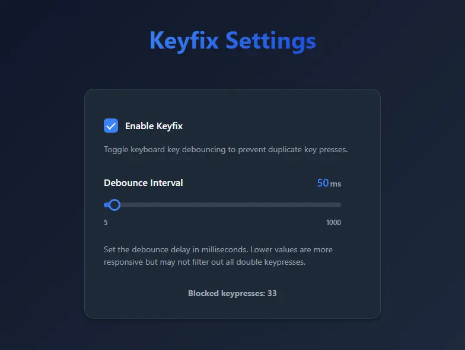

# keyfix

Fix duplicate keypresses in a faulty keyboard by debouncing them. Debounce interval can be adjusted.
Only works on Windows.

## How to use

1. Download the latest release
2. Double click it
3. Done!

The app will continue to run in the background if the window is closed, to completely close go to your system tray and right click it.

## Development instructions

1. Install Rust, Node, and pnpm
2. Clone the repo
3. Run `pnpm install` to install all the frontend dependencies
4. Then run `pnpm tauri dev` to start the development server and Rust application

## Build for release

Run

`pnpm tauri build`

Binaries will be outputted to `src-tauri/target/release`

## Contributions

Contributions of any kind are always welcome. Feel free to clone the repo, make a new branch, and submit your changes in a PR. Thank you!

## Credits

Logo created by [iSlammedMyKindle](https://github.com/islammedmykindle)

## License

MIT
